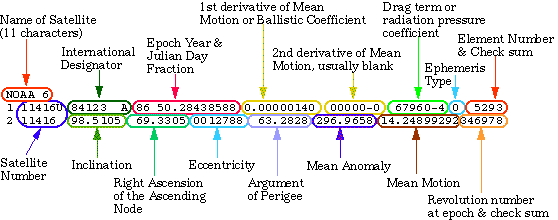

# TLE参数详解

[TLE详解网页]: http://www.stltracker.com/resources/tle	"TLE详解网页"

[pyEphemCSDN博客]: https://blog.csdn.net/eaglesoars/article/details/81048089	"TLE博客"

[卫星轨道详解]: III.4.1.4_Describing_Orbits.pdf	"卫星轨道详解"

# 轨道周期易混概念

轨道周期 / 运行周期：人造卫星在椭圆轨道上运动一圈所需要的时间。

 

重复周期 / 轨道重访周期：卫星相对地球而言，两次轨道完全重合所需时间间隔，即人造卫星第一次经过某个星下点（地球中心与人造卫星的连线在地球表面上的交点）和第二次经过同一个星下点的时间间隔。

 

重访周期：观测卫星对同一地点相邻两次观测的时间间隔。

（导致重访的原因有三种：轨道重访（见上面）、倾斜观测（侧摆）、大幅宽观测（重叠）。）

（从被观测这个事件的角度，卫星完成了一个周期）

 

然后，书上所说的

【时间分辨率】有的时候指的是【轨道重访周期】，有的时候指的是【重访周期】。

【重访周期】有的时候指的是【轨道重访周期】，有的时候指的是【重访周期】。

具体是哪种意思要结合语境。

# 常见遥感卫星参数

|    传感器     | 发射时间 |  国家  |                多光谱波段                |   空间分辨率    |
| :-----------: | :------: | :----: | :--------------------------------------: | :-------------: |
|   QuickBird   |    01    |  美国  |                 RGB+NIR                  |    0.61-0.72    |
|     SPOT4     |    99    |  法国  |         红、绿、近红外、中远红外         | 全色:10 ;多:20  |
|     SPOT5     |    01    |  法国  |         红、绿、近红外、中远红外         |   全色:2.5/5    |
|    SPOT6/7    |  13/14   |  法国  |            红、绿、蓝、近红外            |    全色:1.5     |
|  Landsat1-7   |  72-99   |  美国  |   红、绿、蓝、近红外、短波红外、热红外   | 15/30/60/80/120 |
|   Landsat8    |   2013   |  美国  |                 11个波段                 |    15/30/100    |
| Sentinel-1A/B |  14/16   | 欧空局 |              微波（C波段）               |    1/2/6/10     |
|  Sentienl-2A  |    15    | 欧空局 |       可见光近&短波红外等13个波段        |    10/20/60     |
|     MODIS     |    /     |  美国  |                 36个波段                 |  250/500/1000   |
|  NOAA series  |    /     |  美国  |      红、近红外、中红外和两个热红外      |      1100       |
|      FY       |    /     |  中国  |     可见光、近红外、中远红外、热红外     |      1100       |
|    HJ-1A/B    |    08    |  中国  | 多光谱近中红外(4波段)、高光谱（111波段） |     30/100      |
|     GF-1      |    13    |  中国  |                 RGB+NIR                  |     2/8/16      |
|     GF-2      |    14    |  中国  |                 RGB+NIR                  |        1        |
|     GF-3      |    16    |  中国  |                SAR(C波段)                |      1-500      |
|     GF-4      |    15    |  中国  |         可见光、近红外、中波红外         |     50/400      |
|   ZY-1 02C    |    11    |  中国  |              红、绿、近红外              |    5/10/2.36    |
|     ZY-3      |    12    |  中国  |                 RGB+NIR                  |    2.1/3.5/6    |

## 高分辨率（0.6-4m）

### SPOT1-5

### QuikBird

| 属性       | 数值                                      |
| ---------- | :---------------------------------------- |
| 质量       | 1018kg（发射后）                          |
| 半长轴     | 6828km                                    |
| 发射窗口   | *1851-1906 GMT*(*1451-1506 EDT*)          |
| 发射工具   | ***Delta II\***                           |
| 星下点分辨 | 0.61m                                     |
| 产品分辨率 | 全色0.61-0.72m，多光谱2.44-2.88m          |
| 产品类型   | 全色、多光谱、全色增强、全色+多光谱捆绑等 |
| 成像方式   | 推扫式成像                                |
| 传感器     | 全色波段、多光谱                          |
| 分辨率     | 0.61（星下点）2.44（星下点）              |
| 波长       | 450-900nm                                 |
| 量化值     | 11位                                      |
| 星下点成像 | 沿轨/横轨迹方向（+/-25度）                |
| 立体成像   | 沿轨 /横轨迹方向                          |
| 辐照宽度   | 以星上点轨迹为中心，左右各272km           |
| 成像模式   | 单景16.5km×16.5km                         |
| 条带       | 16.5km×165km                              |
| 轨道高度   | 450km                                     |
| 倾角       | 98度（太阳同步）                          |
| 重访周期   | 1–6天（70cm分辨率，取决于纬度高低         |

### ZY-1 02C

### ZY-3

**卫星轨道（标称值） [5]** 

轨道形式：太阳同步圆轨道

高度：505.984公里

倾角：97.421°

回归周期：59天

重访周期：5天

降交点地方时：10:30AM

**卫星重量**

约2650kg

**卫星寿命**

在轨工作寿命5年

**地面像元分辨率**

前视、后视相机：3.5m

正视相机：2.1m

多光谱相机：5.8m

覆盖宽度： 前视、后视相机:52km

正视相机：50km

多光谱相机：52km

**图像数据压缩比**

全色图像：2：1/4：1可选

多光谱图像：无损压缩

数传通道个数：2通道

**卫星载荷**

资源三号卫星采用适应性改进的资源二号卫星平台，配置四台相机：

(1)1台地面分辨率优于2.1米的正视全色TDI CCD相机;

(2)2台地面分辨率优于3.5米的前视、后视全色TDI CCD相机;

(3)1台地面分辨率优于5.8米的正视多光谱相机。

### GF-1

| 参数         | 指标             |
| :----------- | :--------------- |
| 轨道类型     | 太阳同步回归轨道 |
| 轨道高度     | 645km            |
| 轨道倾角     | 98.0506°         |
| 降交点地方时 | 10:30 AM         |
| 回归周期     | 41 天            |

### GF-2

| 参数         | 指标             |
| :----------- | :--------------- |
| 轨道类型     | 太阳同步回归轨道 |
| 轨道高度     | 631km            |
| 轨道倾角     | 97.9080°         |
| 降交点地方时 | 10:30 AM         |
| 回归周期     | 69 天            |

## 中分辨率（4-30m）

### LANDSAT

Landsat 4-5 TM(专题制图仪) (1982-1992)
Landsat 1-5 MSS(多光谱扫描仪) (1972-1992)

## 低分辨率（30-1000m）

NOAA系列卫星的AVHRR传感器

Terra和Aqua上的MODIS

风云气象卫星

# 来自另一篇博客的介绍

***\*一、    CBERS中巴资源卫星\****

CBERS-1 中巴资源卫星由中国与巴西于1999年10月14日合作发射，是我国的第一颗数字传输型资源卫星

卫星参数：

太阳同步轨道 轨道高度：778公里,倾角:98.5o 重复周期：26天 平均降交点地方时为上午10：30 相邻轨道间隔时间为 4 天扫描带宽度:185公里星上搭载了CCD传感器、IRMSS红外扫描仪、广角成像仪，由于提供了从20米-256米分辨率的11个波段不同幅宽的遥感数 据，成为资源卫星系列中有特色的一员。

**红外多光谱扫描仪**：波段数： 4波谱范围：B6：0.50 –1.10(um)B7：1.55 – 1.75(um)B8：2.08 – 2.35(um)B9：10.4 – 12.5(um)覆盖宽度：119.50公里空间分辨率：B6 – B8：77.8米B9：156米 CCD相机：波段数： 5波谱范围： B1：0.45 – 0.52(um)B2：0.52 – 0.59(um)B3：0.63 – 0.69(um)B4：0.77 – 0.89(um)B5：0.51 – 0.73(um)覆盖宽度：113公里空间分辨率：19.5米(天底点)侧视能力：-32 士32

**广角成像仪**：波段数：2波谱范围：B10：0.63 – 0.69(um)B11：0.77 – 0.89(um)覆盖宽度：890公里空间分辨率：256米

CBERS-1卫星于1999年10月14日发射成功后，截止到2001年10月14日为止，它在太空中己运行2年，围绕地球旋转10475圈，向地面发送了大量的遥感图像数据，已存档218201景0级数据产品。 CBERS-1卫星的设计寿命是2年，但据航天专家测定CBERS-1卫星在轨道上运行正常。有效载荷除巴西研制的宽视场成像仪于2000年5月9日因电 源系统故障失效外，其余均工作正常，而且目前星上的所有设备均工作在主份状态，备份设备还未启用，星上燃料绰绰有余。因此，虽然卫星设计寿命是2年，但航 天专家设计时对各个器件都打有超期服役的余量，从CBERS-1卫星目前的运行情况来，其寿命肯定要远远大于2年。所以欢迎用户继续踊跃使用CBERS- 1的数据。

**CBERS-1**

波段扫描仪波长范围(μm)地面分辨率1红外多光谱扫描仪B6：0.50 –1.1077.8米2红外多光谱扫描仪B7：1.55 – 1.7577.8米3红外多光谱扫描仪B8：2.08 – 2.3577.8米4红外多光谱扫描仪B9：10.4 – 12.5156米5CCD相机B2：0.52 – 0.5919.5米(天底点)6CCD相机B3：0.63 – 0.6919.5米(天底点)7CCD相机B4：0.77 – 0.8919.5米(天底点)8CCD相机B5：0.51 – 0.7319.5米(天底点)9广角成像仪B10：0.63 – 0.69256米10广角成像仪B11：0.77 – 0.89256米

***\*
二、    法国SPOT卫星\****

法国SPOT-4卫星轨道参数：

轨道高度：832公里

轨道倾角：98.721o

轨道周期：101.469分/圈

重复周期：369圈/26天

降交点时间：上午10：30分

扫描带宽度： 60 公里

两侧侧视：+/-27o 扫描带宽：950公里

波谱范围：

多光谱XI B1 0.50 – 0.59um

20米分辨率 B2 0.61 – 0.68um

B3 0.78 – 0.89um

SWIR 1.58 – 1.75um

全色P10米 B2 0.61 – 0.68um

**SPOT-5**

波 段波长范围(μm)高分辨率几何装置植被成像装置高分辨率立体装置1PA：0.49-0.692.5m或5m—10m2B0：0.43-0.47—1km—3B1：0.49-0.6110m——4B2：0.61-0.6810m1km—5B3：0.78-0.8910m1km—6SWIR：1.58-1.7520m1km—

**立体成像装置**

| 装置         | HRS沿轨道方向形成像对                                        | HRG的像对成像能力轨道交叉方向形成                            | HRVIR的像对成像能力轨道交叉方向形成                          | HRV的像对成像能力轨道交叉方向形成                            |
| ------------ | ------------------------------------------------------------ | ------------------------------------------------------------ | ------------------------------------------------------------ | ------------------------------------------------------------ |
| 波段及分辨率 | 沿轨道方向1 个全色波段（10米），通过重采样方式形成5米分辨率。垂直于轨道方向5米分辨率。 | 2景全色影像（5米），可以生成一景2.5米影像3个多光谱波段（10米）1个短波红外波段（20米） | 1个全色波段（10米）3个多光谱波段（20米）1个短波红外波段(20 m) | 1个全色波段（10米）3个多光谱波段（20 m）                     |
| 波谱范围     | P: 0.49 - 0.69 µm                                            | P: 0.48 - 0.71 µmB1: 0.50 - 0.59 µmB2: 0.61 - 0.68 µmB3: 0.78 - 0.89 µmB4: 1.58 - 1.75 µm | M: 0.61 - 0.68 µmB1: 0.50 - 0.59 µmB2: 0.61 - 0.68 µmB3: 0.78 - 0.89 µmB4: 1.58 - 1.75 µm | P: 0.50 - 0.73 µmB1: 0.50 - 0.59 µmB2: 0.61 - 0.68 µmB3: 0.78 - 0.89 µm |

**植被成像装置**

|          | SPOT 5                                                       | SPOT 4                                                       |
| -------- | ------------------------------------------------------------ | ------------------------------------------------------------ |
| 装置     | 植被成像装置2                                                | 植被成像装置1                                                |
| 波段数   | 4                                                            | 4                                                            |
| 电磁波谱 | B0: 0.45 - 0.52 µmB2: 0.61 - 0.68 µmB3: 0.78 - 0.89 µmB4: 1.58 - 1.75 µm | B0: 0.45 - 0.52 µmB2: 0.61 - 0.68 µmB3: 0.78 - 0.89 µmB4: 1.58 - 1.75 µm |
| 分辨率   | 1,000 米                                                     | 1,000 米                                                     |

**三、ERS卫星**
ERS-1 ERS-2 欧空局分别于1991年和1995年发射。携带有多种有效载荷，包括侧视合成孔径雷达（SAR）和风向散射计等装置），由于ERS-1（2）采用了先进的微波遥感技术来获取全天候与全天时的图象，比起传统的光学遥感图象有着独特的优点。

卫星参数：

椭圆形太阳同步轨道

轨道高度：780公里

半长轴：7153.135公里

轨道倾角：98.52o

飞行周期：100.465分钟

每天运行轨道数：14 -1/3

降交点的当地太阳时：10：30

空间分辨率：方位方向<30米

距离方向<26.3米

幅宽：100公里

***\*四、    日本JERS-1卫星\****

JERS-1日本宇宙开发事业团于1992年发射。用于国土调查、农林渔业、环境保护、灾害监测。星上传感器SAR。

卫星参数：

太阳同步轨道

赤道上空高度：568.023公里

半长轴：6946.165公里

轨道倾角：97.662o

周期：96.146分钟

轨道重复周期：44天

经过降交点的当地时间：10：30-11：00

空间分辨率：方位方向18米

距离方向18米

幅宽：75公里

***\*五、    RADARSAT-1\****

RADARSAT卫星是加拿大于95年11月4日发射的，它具有7种模式、25种波束，不同入射角，因而具有多种分辨率、不同幅宽和多种信息特征。适用于全球环境和[土地](http://www.tuliu.com/)利用、自然资源监测等。

卫星参数：

太阳同步轨道（晨昏）

轨道高度：796公里

倾角：98.6o

运行周期：100.7分钟

重复周期：24天

每天轨道数：14

卫星过境的当地时间约为早6点晚6点。

重量：2750kg

工作模式 波束位置 入射角（度） 标称分辨率（米） 标称轴宽(公里)

精细模式（5个波束位置） F1- F5 37---48 10 50x50

标准模式（7个波束位置） S1- S7 20---49 30 100x100

宽模式 （3个波束位置） W1-W3 20---45 30 150x150

窄幅ScanSAR （2个波束位置） SN1 20---40 30 300x300

SN2 31---46 30 300x300

宽幅ScanSAR SW1 20---49 100 500x500

超高入射角模式（6个波束位置） H1-H6 49---59 25 75x75

超低入射角模式 L1 10---23 35 170x170

总结如下：

RADARSAT：

波段模式(μm)地面分辨率单波束模式标准模式（Standard Beam，简称S）约30米宽模式（Wide Beam，简称W）约30米精细模式（Fine Beam，简称F）约 8 米超高模式（Extended High Beam，简称EH）约25米超低模式（Extended Low Beam，简称EL）约35米ScanSAR模式（2至4种单波束模式组成）窄幅ScanSAR（ScanSAR Narrow，简称SCN）50米宽幅ScanSAR（ScanSAR Wide，简称SCW）100米

***\*
六、    美国陆地卫星(Landsat系列)（按传感器分类）\****

**1.RBV**

RBV是陆地卫星1~3号上携带的一套传感器，其全称是反束光导管摄像仪，简称RBV.在Lansat-1，Lansat-2上有三个波段：

RBV1波段：蓝绿波段，波长范围是0.475μm~0.575μm；

RBV2波段：红黄波段，波长范围是0.580μm~0.680μm；

RBV3波段：红外波段，波长范围是0.690μm~0.830μm；

在Lansat-3上RBV改成两台并列式，只有一个全色工作波段0.505μm~0.705μm，Lansat-1，Lansat-2的RBV的空间分辨率为80m，而Lansat-3上的RBV全色图像分辨率为40m。

犹豫RBV的图像质量不如MSS，故从Landsat-4开始取消了这种传感器。

**2.MSS**

多光谱扫描仪MSS，是Lansat-1，Lansat-2，Lansat-3，Lansat-4，Lansat-5上都携带的传感器，其数字产品是MSS磁带，地面分辨率是80m。一景MSS影像数据大约有2340个扫描行，每一个扫描行有3240个像元（像素）点，而一景MSS影像对应的实际地面面积是185km*185km,所以像元点的实际大小对应地面为79m*57m。MSS传感器所采用的波段为：

MSS4波段：蓝绿波段，波长范围是0.5μm~0.6μm；

MSS5波段：红蓝波段，波长范围是0.6μm~0.7μm；

MSS6波段：红外波段，波长范围是0.7μm~0.8μm;

MSS7波段：红外波段，波长范围是0.8μm~1.1μm。

**3.TM**

TM称为专题绘图仪，是Lansat-4，Landsat-5上携带的传感器，其数字产品是TM磁带。TM的波普范围比MSS大，工作波段多，共有7个，分别是：

TM1波段：蓝光波段，波长范围是0.45μm~0.50μm；

TM2波段：绿光波段，波长范围是0.52μm~0.60μm；

TM3波段：红光波段，波长范围是0.63μm~0.69μm；

TM4波段：近红外波段，波长范围是0.76μm~0.94μm；

TM5波段：中红外波段，波长范围是1.55μm~1.75μm；

TM6波段：热红外波段，波长范围是10.4μm~12.5μm；

TM7波段：中红外波段，波长范围是2.08μm~2.35μm；

Lansat的地面分辨率为30M（TM6的地面分辨率只有120m），其亮度数字化级数为256（MSS只有65级）。一景TM影像对应地面面积为185km*185km，每一波段大约有5965条扫描行，每一扫描行有6967个像元点。

陆地卫星5号载了专题绘图传感器（TM）

卫星参数：

近极近环形太阳同步轨道

轨道高度：705公里

倾角:98.22o

运行周期：98.9分钟

24小时绕地球:15圈

穿越赤道时间:上午10点

扫描带宽度:185公里

重复周期:16天 卫星绕行:233圈

波段号 波段 频谱范围μ 分辨率m

B1 Blue-Green 0.45 – 0.52 30

B2 Green 0.52 - 0.60 30

B3 Red 0.63 - 0.69 30

B4 Near IR 0.76 - 0.90 30

B5 SWIR 1.55 – 1.75 30

B6 LWIR 10.40 – 12.5 120

B7 SWIR 2.08 - 2.35 30

**4.ETM**

美国陆地卫星七号 (LANDSAT-7)

陆地卫星7号于1999年4月15日由美国航空航天局发射，携带了增强型主题成像传感器（ETM+）

卫星参数：

近极近环形太阳同步轨道

轨道高度：705公里

倾角:98.22o

运行周期：98.9分钟

24小时绕地球:15圈

穿越赤道时间:上午10点

扫描带宽度:185公里

重复周期:16天 卫星绕行:233圈

波段号 类型 波谱范围 地面分辨率

1 Blue-Green 0.450-0.515 30m

2 Green 0.525-0.605 30m

3 Red 0.630-0.69 30m

4 Near IR 0.775-0.90 30m

5 SWIR 1.550-1.75 30m

6 LWIR 10.40-12.5 60m

7 SWIR 2.090-2.35 30m

8 Pan 0.520-0.90 15m

总结如下：

LandSat：

波段波长范围(μm)分辨率TM波段0.45～0.5330米0.52～0.6030米0.63～0.6930米0.76～0.9030米1.55～1.7530米10.40～12.50>120米ETM＋波段0.45～0.51530米0.525～0.60530米0.63～0.69030米0.75～0.9030米1.55～1.7530米10.40～12.5060米2.09～2.3530米0.52～0.9015米MSS波段0.5～0.678米0.6～0.778米0.7～0.878米0.8～1.178米

**Landsat7**

波段号类型波谱范围μm地面分辨率1Blue-Green0.450-0.51530m2Green0.525-0.60530m3Red0.630-0.6930m4Near IR0.775-0.9030m5SWIR1.550-1.7530m6LWIR10.40-12.560m7SWIR2.090-2.3530m8Pan0.520-0.9015m

**Landsat5**

波段号波段频谱范围μm分辨率mB1Blue-Green0.45 – 0.5230B2Green0.52 - 0.6030B3Red0.63 - 0.6930B4Near IR0.76 - 0.9030B5SWIR1.55 – 1.7530B6LWIR10.40 – 12.5120B7SWIR2.08 - 2.3530

***\*
七、    IKONOS\****

发射日期 :1999 年 9月 24日

空间分辨率 全色波段 : 1m (观测角 26o 以内) 多光谱波段 : 4m (观测角26o 以内)

影像光谱频带

全色波段 : 0.45-0.90 微米 多光谱波段: 1. 蓝 0.45-0.52 微米 2. 绿0.52-0.60 微米 3. 红 0.63-0.69 微米 4. 近红外 0.76-0.90 微米 (同Landsat4 & 5 的 1-4 波段)

多光谱波段

卫星扫描带宽度 :11㎞ (垂直方向) 扫描面积 : 11×11㎞ - 130×56㎞ - 37×100㎞ - 11×100㎞ - 11×1000㎞ 镶嵌图 : 最大 10,000 平方公里

水平/垂直精度

未使用 GCP : 12米水平精度(圈型误差 CE 为 90%) 10米垂直精度(90%LE) 使用 GCP: 2米水平精度(圈型误差 CE 为 90%) 3米垂直精度(90%LE)

轨道参数

高度 :681㎞ 倾角 :98.1o 速度 :7㎞ / sec 通过赤道的时间 :上午10:30 重访周期 :在北纬40度上方，分辨率为 1m 时 2.9 天；分辨率为 1.5m 时 1.6 天轨道周期 :98 分 轨道类型 :太阳同步轨道 观测角 :沿着轨道和交叉在轨道的形式之间互换简便 重量 :817 公斤

**IKONOS**

| 通道 | 波长范围（nm ）       | 地面分辨率                                                   |
| ---- | --------------------- | ------------------------------------------------------------ |
| 1    | ( 蓝色 ): 0.45-053    | 星下点:0.82 米，全色： 1 米，多光谱： 4 米；重访频率：1米分辨率：2.9天 ，1.5米分辨率:1.5天 |
| 2    | ( 绿色 ): 0.52-0.61   |                                                              |
| 3    | ( 红色 ): 0.64-0.72   |                                                              |
| 4    | ( 近红外 ): 0.77-0.88 |                                                              |

***\*
八、    Quick Bird(快鸟)数据\****

成像方式 推扫式成像

传感器 全波段 多光谱

分辨率 0.61米（星下点） 2.44米（星下点）

波长 450-900nm 蓝： 450-520nm

绿： 520-600nm

红： 630-690nm

近红外：760-900nm

量化值 11 位

星下点成像 沿轨/横轨迹方向（+/-25度）

立体成像 沿轨/横轨迹方向

辐照宽度 以星下点轨迹为中心，左右各272公里

成像模式 单景 16.5公里 X 16.5公里

条带 16.5公里 X 165公里

轨道高度 450公里

倾角 98度（太阳同步）

重访周期 1 – 6天 （70厘米分辨率，取决于纬度高低）

**QuickBird**

| 通道 | 波长范围（nm ）    | 地面分辨率（星下点）                                         |
| ---- | ------------------ | ------------------------------------------------------------ |
| 1    | 蓝 :450-520        | 全色: 0.61m多光谱: 2.44m全色：61厘米到72厘米多光谱：244厘米到288厘米 |
| 2    | 绿 : 520-660       |                                                              |
| 3    | 红：630-690nm      |                                                              |
| 4    | 近红外 : 760-900nm |                                                              |

***\*
九、    NOAA\****

| 通道       | 波长范围（μ m ） | 地面分辨率（星下点， km ） |
| ---------- | ---------------- | -------------------------- |
| AVHRR － 1 | 0.55 ～ 0.68     | 1.1                        |
| AVHRR － 2 | 0.725 ～ 1.1     | 1.1                        |
| AVHRR － 3 | 3.55 ～ 3.93     | 1.1                        |
| AVHRR － 4 | 10.5 ～ 11.3     | 1.1                        |
| AVHRR － 5 | 11.5 ～ 12.5     | 1.1                        |

***\*
十、    GeoEye-1\****

| 通道 | 波长范围（μm ）             | 地面分辨率（星下点）       |
| ---- | --------------------------- | -------------------------- |
| 1    | 蓝 : 0.45 μm ---0.51 μm     | 全色 0.41 米多光谱 1.65 米 |
| 2    | 绿 : 0.51 μm ---0.58 μm     |                            |
| 3    | 红：0.655 μm ---0.690 μm    |                            |
| 4    | 近红外 : 0.78 μm ---0.92 μm |                            |

***\*
十一、     Formosat-2\****

| 通道 | 波长范围（nm ）   | 地面分辨率                 |
| ---- | ----------------- | -------------------------- |
| 1    | 蓝：0.45-0.52     | 全色影像2米；多光谱影像8米 |
| 2    | 绿：0.52-0.60     |                            |
| 3    | 红：0.63-0.69     |                            |
| 4    | 近红外：0.76-0.90 |                            |

***\*
十二、     IRS\****

| 通道 | 波长范围（nm ） | 地面分辨率 |
| ---- | --------------- | ---------- |
| 1    | B1:0.5—0.75     | 5.8m       |
| 2    | B2:0.52—0.59    | 23m        |
| 3    | B3:0.62—0.68    | 23m        |
| 4    | B4:0.77—0.86    | 23m        |
| 5    | B5:1.55—1.70    | 70M        |
| 6    | 0.62—0.68       | 189m       |
| 7    | 0.77—0.86       | 189m       |

***\*
十三、     ZY-1\****

| 通道 | 波长范围（nm ） | 地面分辨率 |
| ---- | --------------- | ---------- |
| 1    | B1：0.45—0.52   | 19.5       |
| 2    | B2:0.52—0.59    | 19.5       |
| 3    | B3:0.63—0.69    | 19.5       |
| 4    | B4:0.77—0.89    | 19.5       |
| 5    | B5:0.51—0.73    | 19.5       |
| 6    | B6:0.51—1.1     | 77.8       |
| 7    | B7:1.55—1.75    | 77.8       |
| 8    | B8:2.08—2.35    | 77.8       |
| 9    | B9:10.4—12.5    | 156        |
| 10   | B10:0.63—0.69   | -          |
| 11   | B11:0.77—0.89   | -          |

***\*
十四、     中分辨率成像光谱仪（MODIS）\****

　　中分辨率成像光谱仪（MODIS）是美国宇航局研制大型空间遥感仪器。它在36个相互配准的光谱波段、以中等分辨率水平（0.25Km～1Km）、每 1～2天观测地球表面一次。获取陆地和海洋温度、初级生产率、陆地表面覆盖、云、汽溶胶、水汽和火情等目标的图像（图3－5）。

**MODIS**

波段波长范围(μm)分辨率（m）1620～6702502841～8762503459～4795004545～56450051230～125050061638～165250072105～21355008405～42010009438～448100010483～493100011526～536100012545～556100013662～672100014673～683100015743～753100016862～877100017890～920100018931～941100019915～9651000203.660～3.8401000213.929～3.9891000223.929～3.9891000234.020～4.0801000244.433～4.4981000254.482～4.9481000261.360～1.3901000276.535～6.8951000287.175～7.4751000298.400～8.7001000309.589～9.88010003110.780～11.28010003211.770～12.27010003313.185～13.48510003413.485～13.78510003513.785～14.08510003614.085～14.3851000

***\*
十五、     OrbView-3\****

| 通道 | 波长范围（nm ）  | 地面分辨率           |
| ---- | ---------------- | -------------------- |
| 1    | 蓝 :450-520      | 全色:1 米多光谱:4 米 |
| 2    | 绿 : 520-600     |                      |
| 3    | 红：625-695      |                      |
| 4    | 近红外 : 760-900 |                      |

***\*
十六、     各国家高分辨率卫星\****

| 国家   | 卫星                                               | 分辨率（全色/多色/高色）                   | 拥有者                                                       |
| ------ | -------------------------------------------------- | ------------------------------------------ | ------------------------------------------------------------ |
| 美国   | IKONOS-1IKONOS-2Eowly 1Quick Bird1Qrbview3Qrbview4 | 1m/4m1m/4m3m/15m0.82m/4m1m/4m1m/4m1m/4m/8m | Space ImagingSpace ImagingEarth WatchEarth WatchOrbital ImagingOrbital Imaging |
| 南非   | Greensat-01                                        | 1.8m                                       | 发射失败                                                     |
| 以色列 | Techsat-IiaEROSDAVID                               | （1-1.5）m/12m(1-2)m/15m5m                 | IIIIAIISA+DLR                                                |